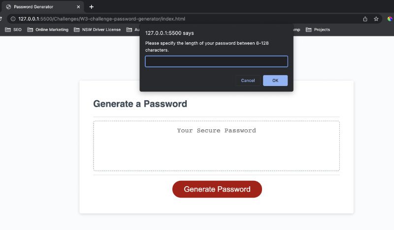
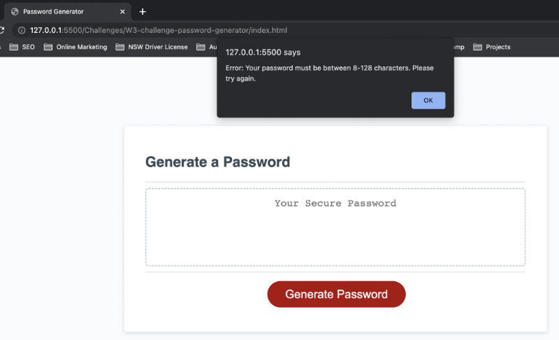
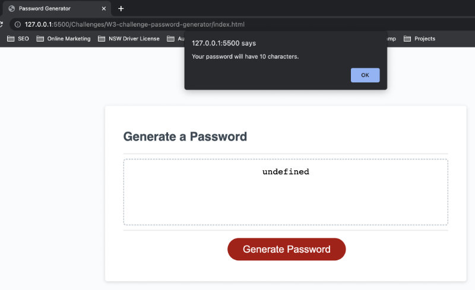
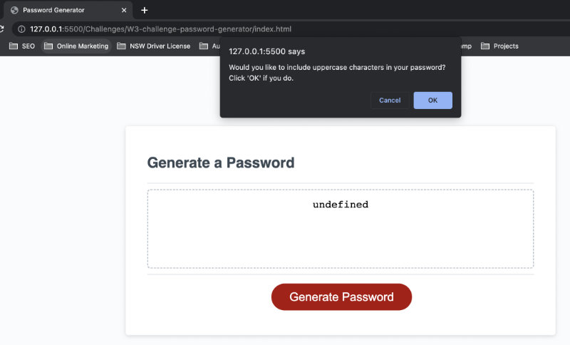
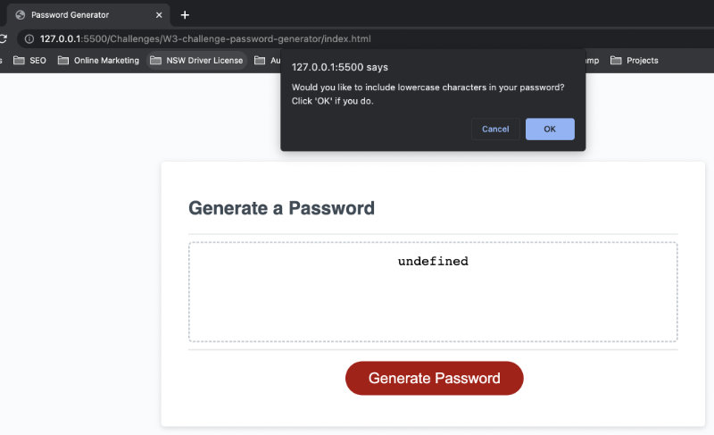
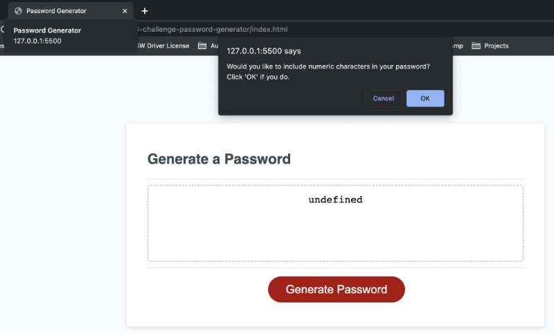
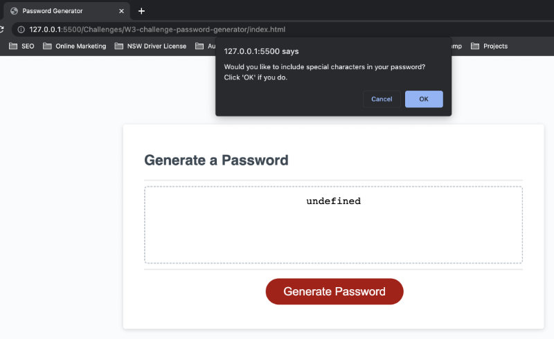
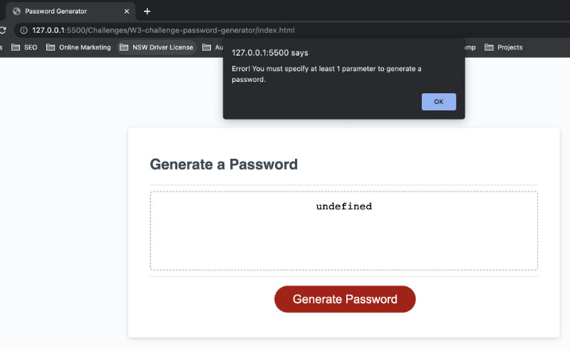

# **W3 Challenge - Password Generator**
In week 3 challenge, we're assigned to create a password generator with javascript programming language. 

The primary purpose of this challenge is to familiarize us with 
* Working with multi-layer variable, i.e., assigning a value for a variable with the value of another variable or function
* Comparison and logical operators, particularly the && and ||
* Conditional statements, particularly the 'if' conditional statement 
* Arrays and accessing an array element with the index in the square bracket, e.g. [i]
* Length property
* The 'for' loop iteration
* Understanding and constructing a function
* Array methonds, including toLowerCase() and concat()
* Math.random and Math.floor
* prompt() and confirm() methods

## **Extended personal research**
* Array.from method - converts a string into an array (https://www.w3schools.com/jsref/jsref_from.asp)
* while() loop - repeats the code until a specified condition is true (https://www.w3schools.com/js/js_loop_while.asp)
* Math.random() and Math.floor (https://www.w3schools.com/js/js_random.asp)

## **URLs**
- [Deployed Application URL]()
- [GitHub Repository URL](https://github.com/jouriena11/W3-challenge-password-generator)

## **Lessons learnt / Key takeaways**
* Window prompt() method takes a user-generated input
* In Window confirm() method, clicking 'Ok' = true and 'Cancel' = false
* The expressions in the 'for' loop is essentially a counter. You don't necessarily need to use an 'i' in the code in the 'for' loop
* Variables can be reassigned.

## **The Acceptance criteria**
The password generator must be able to:
- prompts a user to specify the password length of choice when clicking on the 'Generate Password' button
- asks a user to confirm whether or not he/she wants to include uppercase, lowercase, numeric, and/or special characters in the password and returns an error if the user doesn't select any of these characters at all

## **Expected behavrior**
- When the 'Generate Password' button is clicked, it prompts a user to specify the length of the password with the message

    >Please specify the length of your password between 8-128 characters

- If the user enter an incorrect value (e.g. a number that's less than 8, a number that's greater than 128,
  a negative number, a text, or a blank), the following alert message will appear and the user will have to click the 'Generate Password' button again to re-start the prompt.

    >Error: Your password must be between 8-128 characters. Please try again.

    

- When the use enters a correct value (i.e., a number between 8 and 128), the following alert message will appear before proceeding to the next password criteria.

    >Your password will have (specified length) characters.

    

- When prompting the user to confirm whether or not to include uppercase character in the password, the following confirm() message will appear:

    >Would you like to include uppercase characters in your password? Click 'OK' if you do.

    

- When prompting the user to confirm whether or not to include lowercase character in the password, the following confirm() message will appear:

    >Would you like to include lowercase characters in your password? Click 'OK' if you do.

    

- When prompting the user to confirm whether or not to include numeric character in the password, the following confirm() message will appear:

    >Would you like to include numeric characters in your password? Click 'OK' if you do.

    

- When prompting the user to confirm whether or not to include special character in the password, the following confirm() message will appear:

    >Would you like to include special characters in your password? Click 'OK' if you do.

    

- If the user fails to select at least 1 criteria, the following alert message will appear:

    >Error! You must specify at least 1 parameter to generate a password.

    

- The user is presented with a generated random password in the text area (i.e., inside the dashed-border box), replacing the placeholder text.

